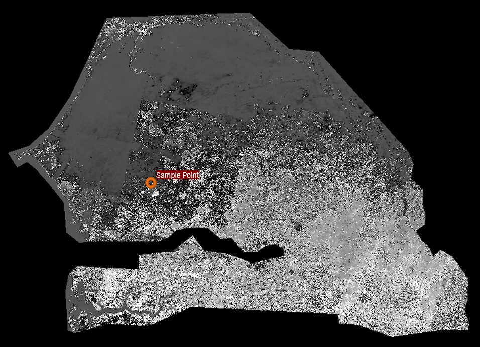
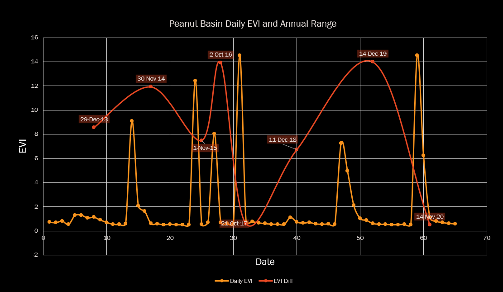
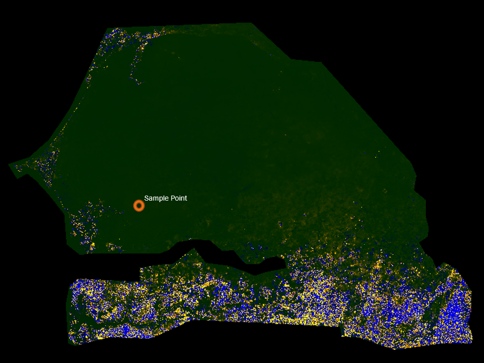

# Looking for Land Degradation in Senegal, Using EVI (Enhanced Vegetation Index)
A little context: 
* These maps and graphs were generated from [Google Earth Engine](https://developers.google.com/earth-engine/guides/getstarted) satellite data.
* Using those fancy data readings from satellites, EVI can be calculated using different parts of the color spectrum and [some math](https://www.usgs.gov/core-science-systems/nli/landsat/landsat-enhanced-vegetation-index?qt-science_support_page_related_con=0#qt-science_support_page_related_con)
* If you want more details on how satellite imagery and GEE works at a fundamental level, check out [this post](https://gis.stackexchange.com/questions/304180/what-are-the-min-and-max-values-of-map-addlayer-on-google-earth-engine)
* These maps and graphs were made in hopes of finding out where the most degraded lands are in Senegal (aka, where usable soil has deteriorated in quality over the past years). 
* The focus region was the Peanut Basin in Senegal:

---
## Annual Max EVI
  
The above map takes the highest EVI per year (from -1 to 1) and averages it out throughout all available years. [**Here's the GEE script**](https://code.earthengine.google.com/7195eb5c856b6f3567ed75ccd704bd98), if you'd like.  
*Basically, the greener it is, the higher the max EVI is for that region.*

  
This graph is the EVI over time of a sample point in Senegal's Peanut Basin. The red dotted lines illustrate the max EVI per year.  
This is the first stage of land degradation analysis. Maximum annual EVIs reflect the greenest times of the year: right after the rainy season. 

## Annual EVI Differences
  
[**Here's the GEE script for this one**](https://code.earthengine.google.com/f948968ca7d10071904dce5f3ccc5182). Based off of the previous algorithm, this map highlights where the greatest differences in EVI are.  
In a single given year, big differences in *greenness* of an area in Senegal indicate farmed lands and where seasonality strongly affects plants and soil.  

  
The above graph was based off of a single sample point in the Peanut Basin.  
The differences in EVI in the sample are greatest in the last few months of the year, which correlates with the peak of the dry season in the Peanut Basin (November to May).  

## EVI Linear Change
   
Using [**Google Earth Engine's linear fitting function**](https://code.earthengine.google.com/402a26173dd1e43bc5360c04f49a5e2a), this above map was generated.  
Using the EVI maximums previously generated, the annual trends of EVI change can be visualized for all of Senegal. Basically, whereever the highest EVI per year has been going down over the past few years, that area will show up as more yellow and orange. If the EVI has been increasing over the past years, that area will look more blue.  
The max EVIs were recorded as independent variables; and depending on the time that passed, the slope of the linear fit would've been more positive or negative. That slope is an indicator of changing EVI.
