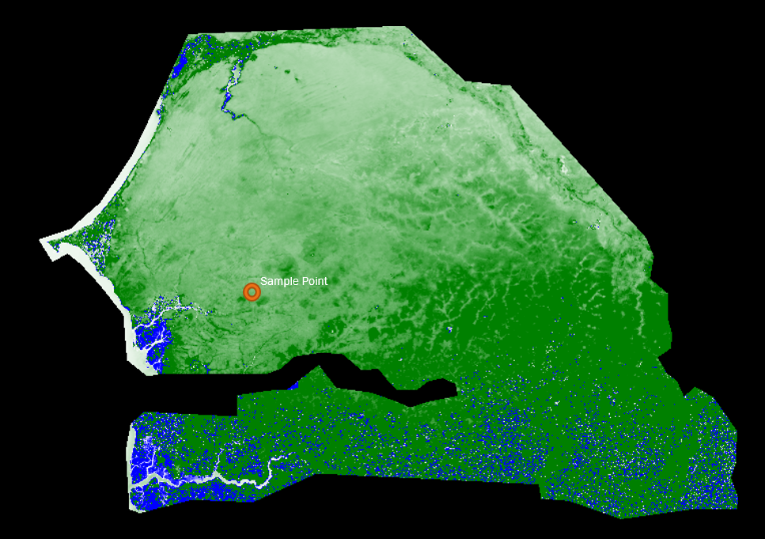
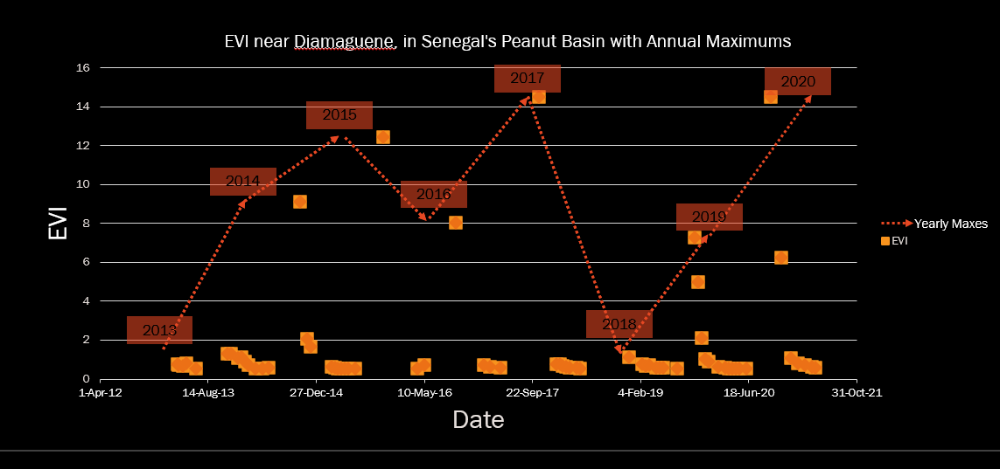

# Looking for Land Degradation in Senegal, Using EVI
## Annual Max EVI
 
The above map takes the highest EVI per year (from -1 to 1) and averages it out throughout all available years. [**Here's the GEE script**](https://code.earthengine.google.com/7195eb5c856b6f3567ed75ccd704bd98), if you'd like.
*Basically, the greener it is, the higher the max EVI is for that region.*

 
This graph is the EVI over time of a sample point in Senegal's Peanut Basin. The red dotted lines illustrate the max EVI per year. 